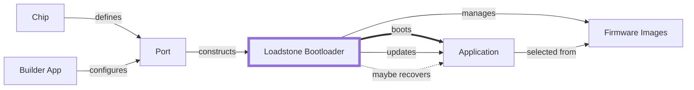
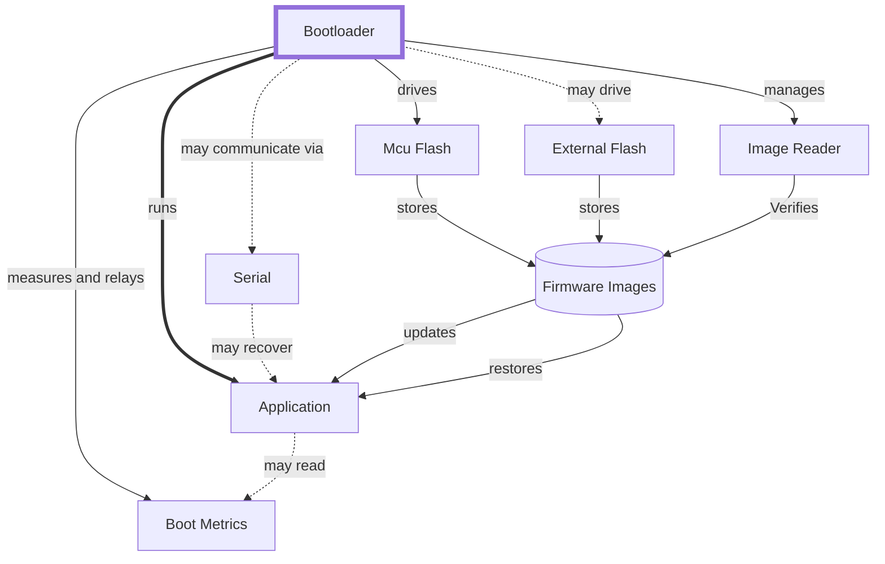
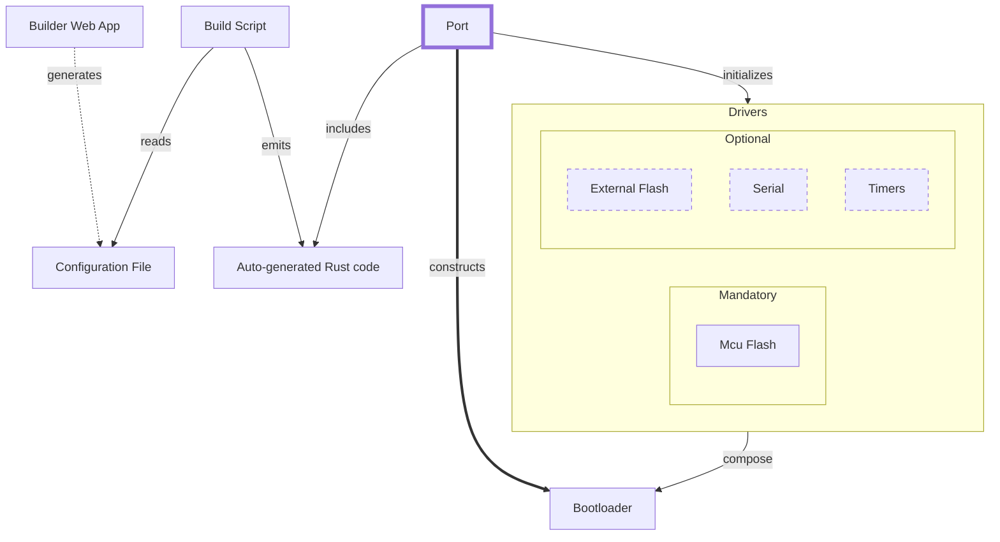
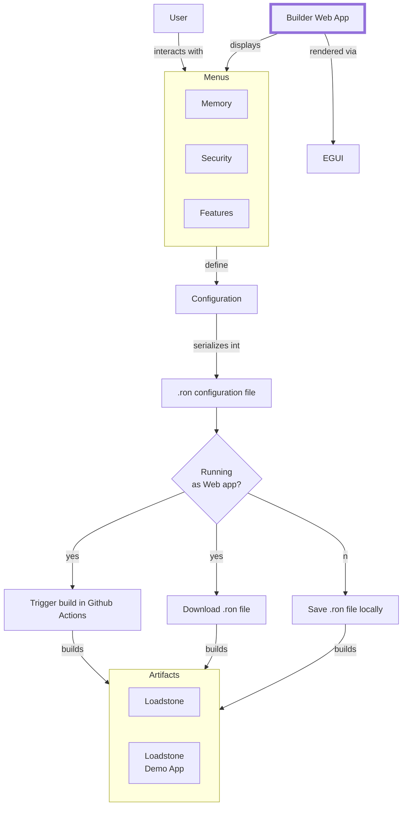
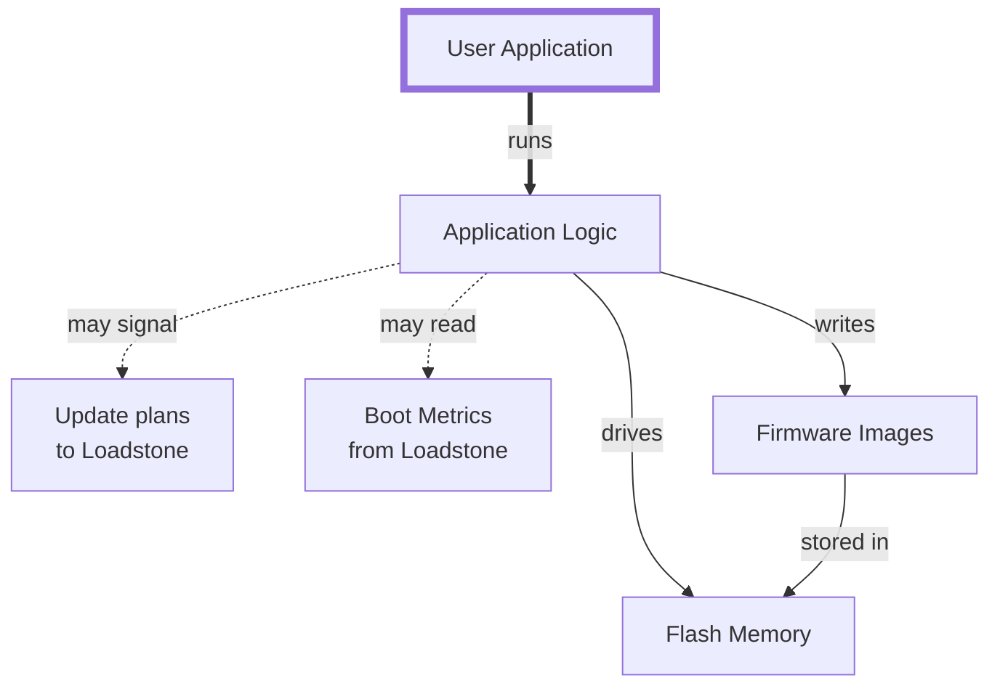
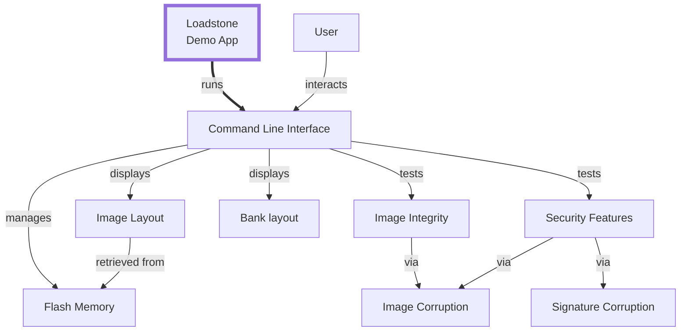
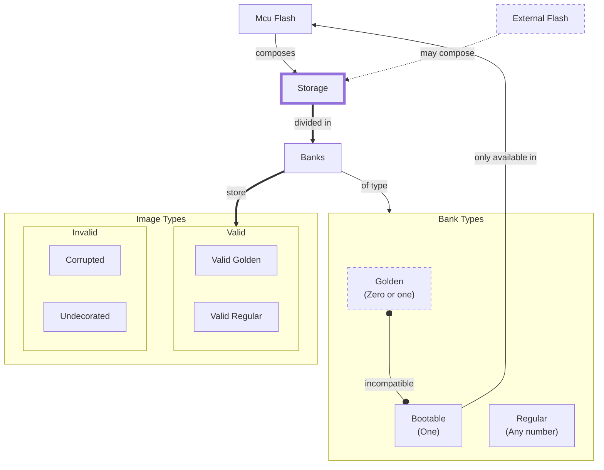
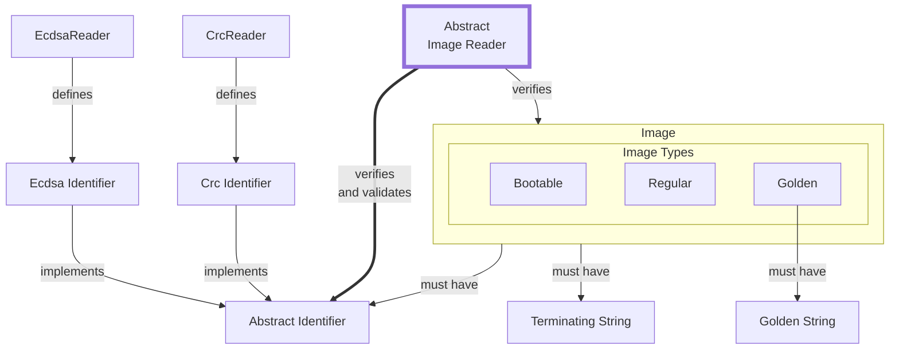

Design documentation contains inline
[mermaid](https://mermaid-js.github.io/mermaid/#/) blocks. Install the [mermaid
browser extension](https://github.com/BackMarket/github-mermaid-extension) if
you want to view them directly on Github, or paste them on the Mermaid Live
Editor.

# Global Context (C1-1)

What follows are the container level diagrams (C2):

## Bootloader (C2-1)

## Codegen Port (C2-2)

## Builder App (C2-3)

## User Application (C2-4)

## Demo Application (C2-5)

Component-level diagrams (C3):

## Firmware Image Storage (C3-1):

## Image Reader (C3-2)

