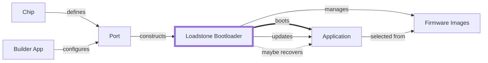
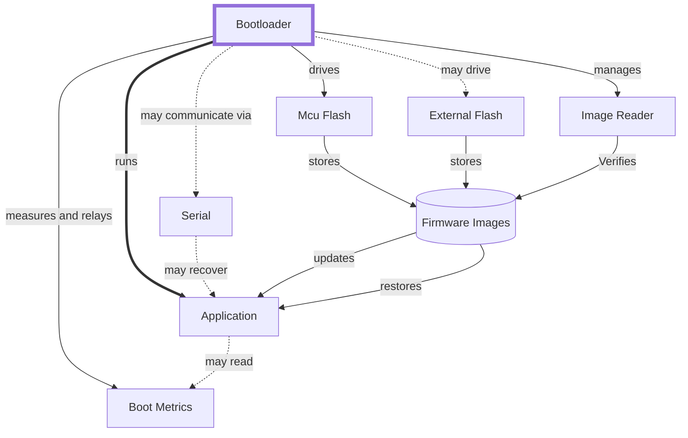
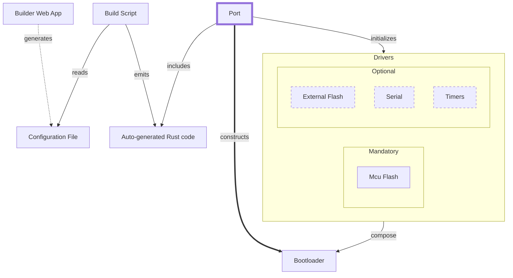
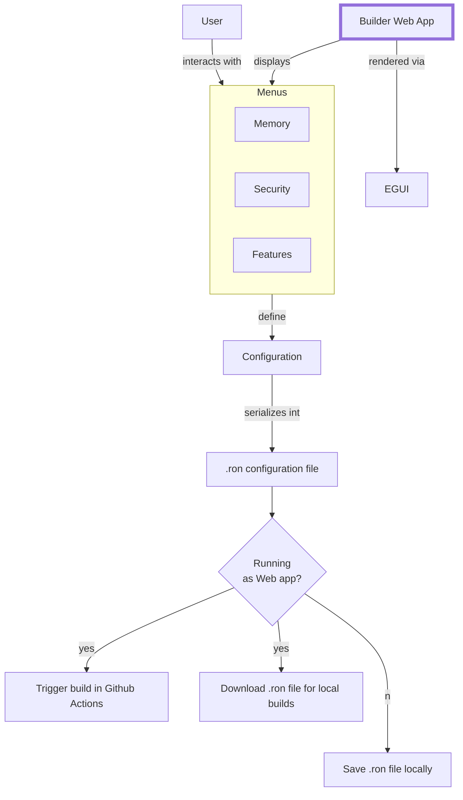

Design documentation contains inline
[mermaid](https://mermaid-js.github.io/mermaid/#/) blocks. Install the [mermaid
browser extension](https://github.com/BackMarket/github-mermaid-extension) if
you want to view them directly on Github, or paste them on the Mermaid Live
Editor.

# Global Context (C1-1)

# Bootloader (C2-1)

# Codegen Port (C2-2)

# Builder App (C2-3)

